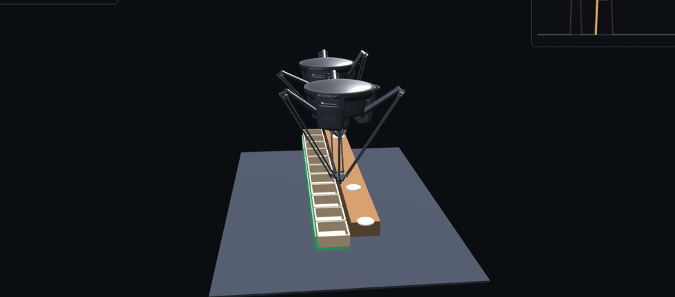

# delta-hil

<p align="center">
  
</p>

<p align="center"><em>Two ABB IRB 360 deltas driven by a real Beckhoff TwinCAT PLC — velocity-matched conveyor tracking in NVIDIA Isaac Sim (top-right: TCP X-velocity locked to the belt at each pick).</em></p>

<p align="center">
  
</p>

<p align="center"><em>…and the <strong>same cell, same PLC code</strong>, rendered <strong>GPU-free in a browser</strong> — this <code>hilweb</code> branch swaps Isaac Sim for a Three.js/WebSocket viewer. <code>--realbot</code> loads the actual ABB IRB 360 CAD on demand (shown); the default is a light stylized delta.</em></p>

Hardware-in-the-loop simulator for **challenging pick-and-place**: ABB **IRB 360
Delta** robots on **NVIDIA Isaac Sim**, closed around a **real industrial PLC**,
with honest pose calibration and deliberate fault injection.

The headline system is a **two-robot food-items cell**: a real **Beckhoff TwinCAT**
soft-PLC runs a continuous conveyor-tracking line — it tracks streamed food items,
splits them between an upstream and a downstream robot, and **velocity-matches** each
pick and place on the fly. The PLC commands a **velocity feed-forward** (the tool's X
is *slaved* to the conveyor speed, PickMaster-style — not a chased position), which
the sim integrates; it just executes, senses, and conserves. The same code also runs
**fully headless on a laptop** (mock PLC + mock plant, no GPU, no controller), which
is the regression net.

> The controller is real, its program is unchanged from sim to bench, and the sim
> reads the controller's own clock.

> **This `hilweb` branch** keeps the plant, `cell_controller`, and TwinCAT program
> **byte-identical** and replaces *only* the renderer — Isaac Sim → a Three.js viewer
> streamed over WebSocket — so the whole cell runs on a **laptop with no GPU** (and,
> with `--realbot`, still shows the real ABB CAD). Controller invariant, renderer swapped.

---

## Run it — easiest first, full cell last

Everything is additive and each rung is independently useful. Start at the top
(needs nothing) and work down as you add a GPU, then the PLC.

### 0 · Laptop — no GPU, no PLC

```bash
pytest -q                      # 40 tests: plant, controller, velocity-match, calibration
python -m deltahil.run         # single-robot mock HIL loop + self-scored calibration
```
`pytest` proves the whole control/plant/calibration stack. `deltahil.run` closes a
mock loop and self-scores **eval 10 (calibration) → PASS** — no hardware at all.

### 1 · Laptop — GPU-free web viewer (this branch)  ⭐

The cell **in a browser, no Isaac, no GPU** — the same `cell_plant` + `cell_controller`
(or a live TwinCAT PLC) streamed to a Three.js viewer over WebSocket:

```bash
pip install -e ".[web]"
python scripts/run_web_cell.py               # http://127.0.0.1:8080  (light stylized delta)
python scripts/run_web_cell.py --realbot     # render the REAL ABB IRB 360 CAD (fetches ~3 MB glTF on demand)
python scripts/run_web_cell.py --plc <AMS>   # driven LIVE by TwinCAT over ADS (reports round-trip)
```
Two deltas over the source + tote belts, tortillas picked into totes, the **TCP-vx-vs-belt
overlay** (bold = velocity-locked, dot at each grab), and a live HUD (placed/min, conserved,
reach). Everything is **vendored** (Three.js + the CAD glTF) — it runs **air-gapped**;
`--realbot` fetches the CAD only when asked, so the default stays instant.

### 2 · Rig — Isaac Sim only, still no PLC

Renders (deterministic mock controller) — the fastest way to *see* the cell at full fidelity:

```bash
python scripts/run_twincat_cell.py mock         # the two-robot cell, deterministic
python scripts/run_twincat_cell.py mock 60      #   ...for 60 s of sim
python scripts/cell_animation.py                # scripted two-robot cell
python scripts/animate_irb360.py                # one IRB 360 pick-and-place (kinematics check)
```
Each writes a video/GIF under `assets/render/`. `run_twincat_cell.py mock` produces
the **same cell** the live PLC drives — use it to preview visuals without TwinCAT.

### 3 · Rig + live TwinCAT — single-robot program

Load `docs/twincat_program.md` (GVLs + `MAIN`) in TwinCAT, build, **Activate (RUN)**,
then pass the target's **AMS NetId**:

```bash
python scripts/run_twincat_mock.py  <AMS_NET_ID> [secs]   # PLC ↔ mock plant, NO Isaac (pure pyads)
python scripts/run_twincat_loop.py  <AMS_NET_ID> [secs]   # PLC drives the Isaac kinematic Delta
python scripts/run_twincat_render.py <AMS_NET_ID> [frames] # PLC drives the articulated IRB 360 → GIF
```
`run_twincat_mock` is the quickest proof the real controller closes the loop (no GPU
boot). All three report the **FAST-tier round-trip latency/jitter** (eval-5 home).

### 4 · Rig + Isaac + live TwinCAT — the full HIL cell (max fidelity)

Load `docs/twincat_cell_program.md` (`GVL_Cell` + `FB_CellRobot` + `MAIN`) in TwinCAT,
build, **Activate (RUN)**, then:

```bash
python scripts/run_twincat_cell.py <AMS_NET_ID>        # the real PLC runs the whole line
python scripts/run_twincat_cell.py <AMS_NET_ID> 50     #   ...for 50 s of sim
```
The real PLC tracks the streamed food items, assigns robots, and commands every TCP +
**velocity feed-forward** + grip live; the sim derives its `dt` from the PLC's own
clock. Output: `assets/render/twincat_cell.mp4` (falls back to `.gif` if no H.264
encoder) with a top-right **TCP-vx-vs-belt overlay** (bold where velocity-locked, a
dot on the belt line at each grab) + a `…_velocity.csv` trace. Console prints the
clock source, **per-robot A/B picks**, the **velocity-lock** split (pick-track vs
place-track), the **ADS round-trip mean/jitter**, and the conservation ledger
(`picked / placed / passed / conserved`). Force `GVL_Cell.enable := FALSE` in a Watch
window to **freeze** the cell live; set `VPLOT = False` for a clean beauty render.

### Command table

| Command | Where | Needs | What you get |
|---|---|---|---|
| `pytest -q` | laptop | nothing | 40 tests pass |
| `python -m deltahil.run` | laptop | nothing | mock HIL loop + eval-10 calibration self-score |
| **`python scripts/run_web_cell.py`** | laptop | `[web]` | **GPU-free browser viewer of the cell (stylized delta)** |
| `python scripts/run_web_cell.py --realbot` | laptop | `[web]` | …with the real ABB IRB 360 CAD (on-demand glTF) |
| `python scripts/run_web_cell.py --plc <AMS>` | laptop | `[web]` + TwinCAT | browser viewer driven live by the PLC |
| `python scripts/run_twincat_cell.py mock [secs]` | rig | Isaac | deterministic two-robot cell → `twincat_cell.mp4/.gif` |
| `python scripts/cell_animation.py` | rig | Isaac | scripted two-robot cell → `cell_pick.gif` |
| `python scripts/animate_irb360.py` | rig | Isaac | one IRB 360 cycle → `irb360_pick.gif` |
| `python scripts/run_twincat_mock.py <AMS> [secs]` | rig | TwinCAT¹ | real PLC ↔ mock plant, FAST latency (no Isaac) |
| `python scripts/run_twincat_loop.py <AMS> [secs]` | rig | Isaac + TwinCAT¹ | real PLC drives kinematic Delta, latency/jitter |
| `python scripts/run_twincat_render.py <AMS> [frames]` | rig | Isaac + TwinCAT¹ | real PLC drives articulated IRB 360 → GIF |
| **`python scripts/run_twincat_cell.py <AMS> [secs]`** | rig | Isaac + TwinCAT² | **the full live cell → `twincat_cell.mp4`** |

¹ single-robot program (`docs/twincat_program.md`) · ² cell program (`docs/twincat_cell_program.md`)

---

## Prerequisites

The **web viewer (tier 1)** needs none of the rig — just `pip install -e ".[web]"` on any
laptop (Python 3.10+, no GPU, no Windows). Everything below is for the Isaac / TwinCAT tiers.

- **GPU workstation** — Windows + an NVIDIA **RTX** GPU (developed on an RTX 4090) — Isaac tiers only.
- **NVIDIA Isaac Sim 5.1**, installed out-of-band; run scripts inside its Python
  environment (`isaacenv`). The scripts import clean on a laptop but only *run* the
  render/loop under Isaac.
- **Beckhoff TwinCAT 3** runtime (for the live tiers 3–4) with an **ADS route** to this
  machine, and the relevant PLC program from `docs/` loaded, built, and **activated
  (RUN)**. The ST programs live in `docs/*.md` — paste each POU into the matching
  TwinCAT pane (mind the `FUNCTION_BLOCK`/`PROGRAM` headers).
- **Python 3.10+** with this package installed editable:
  `pip install -e ".[twincat]"` (adds `pyads` for ADS). `numpy` is core; `Pillow`
  for GIF output; an **ffmpeg-capable `imageio`** (`imageio-ffmpeg`) for the HD MP4 —
  without it, the cell render falls back to a downscaled GIF.
- **USD assets** in `assets/` (the IRB 360 and the cell scene).
- The TwinCAT target's **AMS NetId** (e.g. `5.1.204.123.1.1`) for the live scripts.

---

## The constitution (fixed)

Every module cites these by number; see `src/deltahil/constitution.py`.

| # | Principle |
|---|---|
| P1 | Real-time closed loop — the PLC free-runs on its own oscillator; added latency is physically real |
| P2 | I/O contract is the only channel — the PLC acts solely on its sampled tag map |
| P3 | A pick is a physical coincidence — succeeds iff pose < tol **and** grip in window (the cell adds velocity-match for tracking) |
| P4 | Parallel closed-chain kinematics — the Delta's loop closure (PhysX guide joints) |
| P5 | Calibration corrects bias, not variance — it drives the identifiable bias down, noise floors reliability |
| P6 | Reproducibility is bounded by the live loop — no bit-exact replay; evals are statistical |
| P7 | HIL value is conditional — worth it only if the program under test is real; real faults, $0 core plant |
| A  | Two-tier I/O — FAST (EtherCAT/EtherNet-IP) under the eval-5 jitter bound; SLOW (OPC UA) supervisory |

The cell adds three working invariants on top: **sampled-data honesty** (the sim
advances by the PLC's own `plc_time_ns` clock, one step per sample), a **bounded reach
envelope** (every command is clamped to the measured reach — no over-stretch), and
**velocity-slaved tracking** (the PLC commands a velocity feed-forward so the tracked
axis moves at the conveyor speed, not a one-sample-lagged chased position).

## Cell architecture

```
   sensors (parts/boxes, TCP, grip)  ->        <-  commands (TCP + velocity + grip)
  ┌────────────────┐   ADS sum-read/write   ┌────────────────────────────┐
  │  TwinCAT PLC   │◄──────────────────────►│  CellPlant (pure plant)    │
  │  FB_CellRobot  │   GVL_Cell (mm/LREAL)  │  integrates vel, adjudicates│
  │  x2 + MAIN     │                        │  grasp coincidence, ledger  │
  └────────────────┘                        └────────────────────────────┘
        ▲ plc_time_ns (the shared clock)              ▼ snapshots
        └──►  renderer (SWAPPABLE):  Isaac Sim (RTX)  |  Three.js/WebSocket (this branch, no GPU)
```

- `plant/cell_plant.py` — the pure plant: streams food items + boxes, **integrates the
  commanded velocity feed-forward** (`tcp += vel·dt`) then trims to the position target,
  decides whether a grasp *coincided* in position **and** velocity, and conserves every
  part. It senses and actuates; it never decides control (P1/P2).
- `plc/cell_controller.py` — `MockCellController`, the golden reference the TwinCAT
  `FB_CellRobot` mirrors 1:1. Claim → track (X velocity-slaved to the belt) → grip →
  transfer → place; upstream robot splits, downstream is the catch-all; never abandons a
  pick.
- `plc/cell_link.py` — `CellAdsLink`: one ADS sum-write of sensors, one sum-read of
  commands (TCP + velocity feed-forward + grip) + the PLC clock (m ↔ mm at the seam;
  the velocity symbols are optional, so an older PLC still runs).
- `scripts/run_twincat_cell.py` — boots Isaac, runs the loop against the live PLC
  (or the mock), then renders. `cell_scene.py` (frozen) builds the USD; the render
  script dresses it (steel frame, belts, lighting) additively.
- `render/web/server.py` + `static/viewer.html` — the **web render seam** (this branch):
  runs the same plant + controller (or live TwinCAT) headless and streams ~30 Hz JSON
  snapshots to a Three.js viewer. `--realbot` articulates the real IRB 360 CAD via a JS
  port of `plant/irb360_pose.pose()` (`scripts/build_robot_glb.py` makes the glTF from the
  STEP). No Isaac import on this path.

## The seams (drop in real hardware)

Both sides sit behind `interfaces.py`; nothing upstream changes when you swap them.

| Seam | Light / mock (runs now) | Full / real |
|------|-----------------|------|
| Controller | `plc/mock_plc.py`, `plc/cell_controller.py` | TwinCAT via `plc/twincat_plc.py` / `plc/cell_link.py` (ADS); `plc/logix_plc.py` stub for ControlLogix |
| Plant | `plant/mock_plant.py`, `plant/cell_plant.py` | `plant/isaac_plant.py` — Isaac Sim |
| **Render** | `render/web/` — Three.js browser viewer, no GPU (this branch) | Isaac Sim (`scripts/run_twincat_cell.py`, RTX) |

## Eval status

| Eval | Where | Status |
|------|-------|--------|
| 10 · calibration (P5, P3) | laptop / CI | **self-scored PASS** |
| 3 · grasp on pose∧velocity coincidence (P3) | laptop / rig | mock: **passed 0, conserved** |
| velocity-lock at pick (P3) | laptop / rig | **matched** — grab latches only at &#124;vx−belt&#124; < 0.015 m/s |
| 5 · <10 ms / σ<1 ms round-trip (P1, A) | your rig | **met** — cell ADS ≈ 2.0 ms, σ ≈ 0.25 ms |
| reach envelope never violated (cell) | laptop / rig | **0 violations** in mock + live |
| controller invariance (this branch) | laptop | **`git diff` empty** — controller/plant/ST unchanged vs master |
| web viewer runs GPU-free + offline | laptop | streams + renders (stylized & real CAD), no CDN |

## Handoff

Keep `pytest` green as the regression net. This `hilweb` branch shows the point of the seam
architecture: the renderer is a passive consumer, so **Isaac swaps out for a laptop browser
with the controller untouched**. The next step off the twin is the bench: the **PLC program
is unchanged**, physics and a real gripper replace the plant's grasp adjudication, and a hard
EtherCAT fieldbus replaces the polled ADS clock — the controller keeps its logic; only its
senses swap from silicon to steel.
